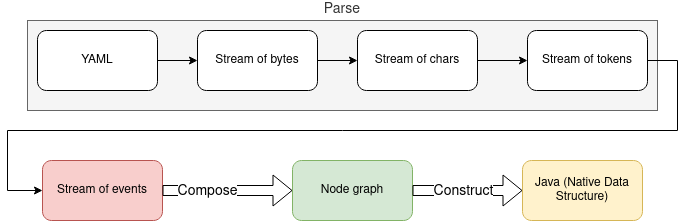

# Contribute to SnakeYAML Engine

## Architecture

Tons of useful information can be found on [the official site](https://yaml.org/spec/1.2.2/).

General step are defined [in the spec](https://yaml.org/spec/1.2.2/#31-processes):


Loading has the following explicit steps (please note that Events form a Stream, not a Tree)



Composer delivers also Stream of Nodes (because there may be more than one document in the YAML
stream, but for simplification the diagram mentions only one Node graph)

## Testing

### Import test date

Engine uses [Comprehensive Test Suite for YAML](https://github.com/yaml/yaml-test-suite) for the
tests.

### Build the data

- clone [YAML Test Suite](https://github.com/yaml/yaml-test-suite)
- take tag (the trunk is work in progress)

```
    git tag | grep data
    git checkout <LATEST TAG>
```

- build with flat data (remove sub-folders)

```shell
make clean data && mv data orig && mkdir data; find orig -name === | sed 's/===//; s/orig\///' | while read d; do (set -x; cp -r orig/$d data/${d/\/0/-0}); done; rm -fr orig
```

- copy *data* folder to `src/test/resources/comprehensive-test-suite-data`

### Check the import

Run the tests and fix the errors:

    ./docker-run-jdk8.sh